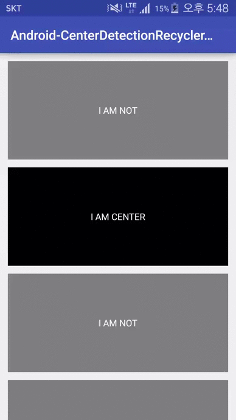

# Android-CenterDetectionRecyclerView
Detecte child view on center



## Update
### 1.2.0
integrated Listener

## Example

add build.gradle<br />
``` groovy
compile 'com.crust87:center-detection-recyclerview:1.2.0'
```

append your layout xml
```xml
<RelativeLayout
    xmlns:android="http://schemas.android.com/apk/res/android"
    xmlns:tools="http://schemas.android.com/tools"
    android:layout_width="match_parent"
    android:layout_height="match_parent">

    <com.crust87.centerdetectionrecyclerview.widget.CenterDetectionRecyclerView
        android:id="@+id/my_recycler_view"
        android:scrollbars="vertical"
        android:layout_width="match_parent"
        android:layout_height="match_parent"/>
</RelativeLayout>

```

load layout and initialize
```java
mLayoutManager = new LinearLayoutManager(this);
mAdapter = new TextAdapter();
mRecyclerView = (CenterDetectionRecyclerView) findViewById(R.id.my_recycler_view);
mRecyclerView.setHasFixedSize(true);
mRecyclerView.setLayoutManager(mLayoutManager);
mRecyclerView.setAdapter(mAdapter);
```

and bind event
```java
mRecyclerView.setCenterDetectionRecyclerListener(new CenterDetectionRecyclerListener() {
    @Override
    public void onCenterViewRecycled(RecyclerView recyclerView, ViewHolder viewHolder) {
        // TODO something
    }

    @Override
    public void onCenterItemChange(RecyclerView recyclerView, ViewHolder viewHolder, ViewHolder oldViewHolder) {
        // TODO something
    }
});
```

see sample code to detail

## Summary
### Public Constructors
| |
|:---|
| CenterDetectionRecyclerView(Context context) |
| CenterDetectionRecyclerView(Context context, AttributeSet attrs) |
| CenterDetectionRecyclerView(Context context, AttributeSet attrs, int defStyleAttr) |

### Public Methods
| | |
|:---|:---|
| ViewHolder | getCenterViewHolder()<br />Get ViewHolder in center item |
| void | setCenterDetectionRecyclerListener(CenterDetectionRecyclerListener listener)<br />Set listener of CenterDetectionRecyclerView |


## License
Copyright 2015 Mabi

Licensed under the Apache License, Version 2.0 (the "License");<br/>
you may not use this work except in compliance with the License.<br/>
You may obtain a copy of the License at

http://www.apache.org/licenses/LICENSE-2.0

Unless required by applicable law or agreed to in writing, software<br/>
distributed under the License is distributed on an "AS IS" BASIS,<br/>
WITHOUT WARRANTIES OR CONDITIONS OF ANY KIND, either express or implied.<br/>
See the License for the specific language governing permissions and<br/>
limitations under the License.
